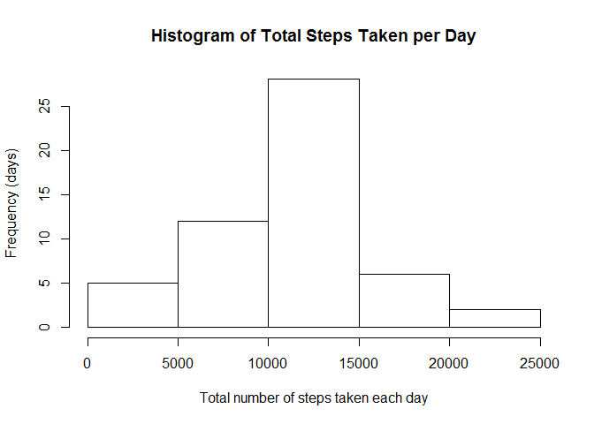
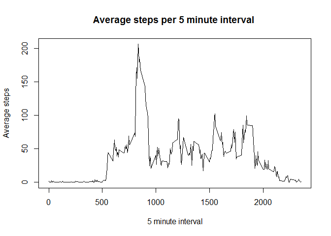
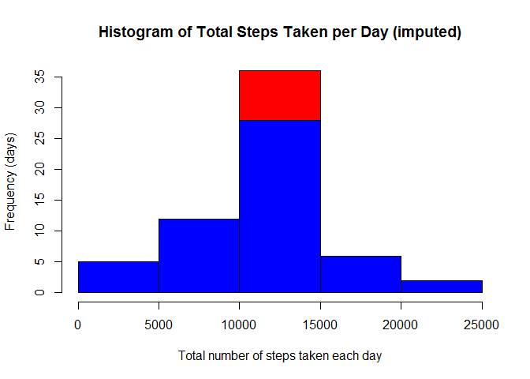
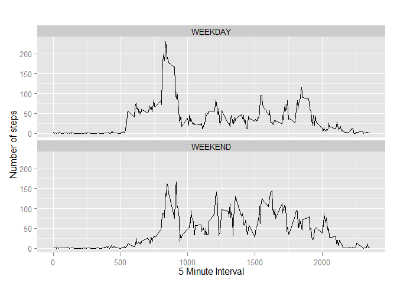

# Reproducible Research: Peer Assessment 1
Erik Ryding  
Sunday, March 15, 2015  

### Loading and preprocessing the data
The data is provided in the repository.
Unzip it and place it in your working directory

Orginal Source: <https://d396qusza40orc.cloudfront.net/repdata%2Fdata%2Factivity.zip>


```r
#setwd("~/DataScience/Reproduceable Research")
activity <- read.csv("activity.csv")
```


### What is mean total number of steps taken per day?

1. **Calculate the total number of steps taken per day**


```r
# Aggregate number of steps, group by date
total_steps_per_date <- aggregate(activity[,c("steps")], by=activity[c("date")], sum)
```

2. **Plot Histogram of Total Steps Taken per Day**


```r
# Plot Histogram of Total Steps Taken per Day
total_steps_per_date <- aggregate(activity[,c("steps")], by=activity[c("date")], sum)
hist(total_steps_per_date$x, main="Histogram of Total Steps Taken per Day", 
     ylab= "Frequency (days)", xlab="Total number of steps taken each day")
```

 

With bar charts, each column represents a group defined by a categorical variable,  
and with histograms each column represents a group defined by a quantitative variable.

3. **Mean and median of the total number of steps taken per day**


```r
complete_activity <- total_steps_per_date[complete.cases(total_steps_per_date),]
# MEAN
mean_steps_per_date <-mean(complete_activity[,2])
# MEDIAN
median_steps_per_date <-median(complete_activity[,2])
```
Mean  : 10766.19
Median: 10765

### What is the average daily activity pattern?

1. **Time series plot of the 5-minute interval (x-axis) and the average number of steps taken, averaged across all days (y-axis)**


```r
#
complete_steps_per_interval <- activity[complete.cases(activity),]
mean_steps_per_interval <- aggregate(complete_steps_per_interval[,c("steps")], by=complete_steps_per_interval[c("interval")], mean)

plot(mean_steps_per_interval$interval, mean_steps_per_interval$x, type="l", main="Average steps per 5 minute interval ", xlab= "5 minute interval", ylab= "Average steps", col="black")
```

 

2. **The 5-minute interval, on average across all the days in the dataset, 
which contains the maximum number of steps**

interval: 835    
steps   : 206.1698 


```r
#
mean_steps_per_interval [which.max(mean_steps_per_interval$x), ]
```

```
##     interval        x
## 104      835 206.1698
```


### Imputing missing values

1. **Calculate and report the total number of missing values in the dataset**

Number of rows missing values: 2304


```r
# subset of all rows with NA
nrow(subset(activity, is.na(activity$steps)))
```

```
## [1] 2304
```


2. **Strategy for filling in all of the missing values in the dataset.**

Subset all rows with NA into a "derived" data frame. 
Apply a derived value to each row. 
Append the "derived" data frame to the "new"" activity data frame (where missing values have been removed) 
The result is a complete "new" activity data frame with no missing values

3. **New dataset that is equal to the original dataset but with the missing data filled in: Data frame** ***new_activity***


```r
# subset of all rows with NA
na_activity <- subset(activity, is.na(activity$steps))
# Take the dataframe "mean_steps_per_interval" and join to dataframe "na_activity" on
# column "interval". This applies the average mean steps for the intervals with NA.  
# Remove the "steps" column containg "NA"
derived_activity <- subset(merge(mean_steps_per_interval,na_activity,by="interval"), select=-c(steps))
# Rename the "X" column which now contains mean values to "steps"  
names(derived_activity)[names(derived_activity) == 'x'] <- 'steps' 
# New data frame with no "NA" values
new_activity <- activity[complete.cases(activity),]
# Append "new_activity" with "derived_activity" -- New derived values
new_activity<-rbind(new_activity,derived_activity)
```

4a. **Histogram of the total number of steps taken each day**


```r
new_total_steps_per_date <- aggregate(new_activity[,c("steps")], by=new_activity[c("date")], sum)
hist(new_total_steps_per_date$x, col='red', main="Histogram of Total Steps Taken per Day (imputed)", ylab= "Frequency (days)", xlab="Total number of steps taken each day")
hist(total_steps_per_date$x, , col='blue', add=T, main="Histogram of Total Steps Taken per Day", ylab= "Frequency (days)", xlab="Total number of steps taken each day")
```

 

The red part shows the increase in frequency of days.
After imputing missing values the frequency of days has increased to 35 where number
of steps is between 10,000 and 15,000.


4b. **Mean and Median after imputing**


```r
#
new_complete_activity <- new_total_steps_per_date[complete.cases(new_total_steps_per_date),]
new_mean_steps_per_date <-mean(new_complete_activity[,2]) 
new_median_steps_per_date <-median(new_complete_activity[,2])
```

***Mean*** **does not change**
***with*** **imputing missing values**

```r
mean(new_complete_activity[,2])
```

```
## [1] 10766.19
```

***Median*** **has slight increase (from 10765 to 10766.19)**
***with*** **imputing missing values**

```r
median(new_complete_activity[,2])
```

```
## [1] 10766.19
```


### Are there differences in activity patterns between weekdays and weekends?

1. **Create a new factor variable in the dataset with two levels - "weekday" and "weekend"** 


```r
#store langugage settings
user_lang <- Sys.getlocale("LC_TIME")
Sys.setlocale("LC_TIME", "English")
```

```
## [1] "English_United States.1252"
```

```r
require(lubridate)
```

```
## Loading required package: lubridate
```

```r
new_activity$day <- ifelse(wday(new_activity$date) %in% c(2,3,4,5,6),'WEEKDAY', 'WEEKEND')
#restore language
Sys.setlocale("LC_TIME", user_lang)
```

```
## [1] "German_Switzerland.1252"
```

convert new_activity$day from character to factor

```r
new_activity$day <- as.factor(new_activity$day)
```

2.**Panel plot containing a time series plot of the 5-minute interval (x-axis) and the average number of steps taken, averaged across all weekday days or weekend days (y-axis)** 

```r
# mean steps, group by interval and day (week, weekend)
mean_steps_per_interval_day <- aggregate(steps ~ interval+day, new_activity, mean)
# make the panel plot for weekdays and weekends
library(ggplot2)
qplot(interval, steps, data=mean_steps_per_interval_day, geom=c("line"), xlab="5 Minute Interval", 
      ylab="Number of steps", main="") + facet_wrap(~ day, ncol=1)
```

 
